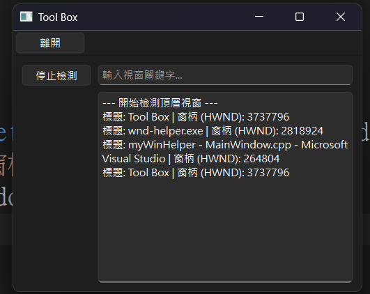

## Dev Log
* [WIP] UI: 用Qt完成基本的介面
* [TODO -> DONE] 補回功能函式: CLI上運行的功能都沒辦法用了，等UI完成再補回;補完原本的函式功能。
* [TODO] 顯示當前作業統所有的視窗標題
* [TODO] 以視窗標題或窗柄搜尋視窗
* [TODO] 放大鏡:
* [TODO] 顏色採樣:
* [TODO] 以HWND採樣目標視窗並單獨顯示
* [TODO] 目標視窗快照
## Dev Img

<table>
  <tr>
    <td align="center">
      
       
      <em>目前狀態</em>
    </td>
  </tr>
</table>